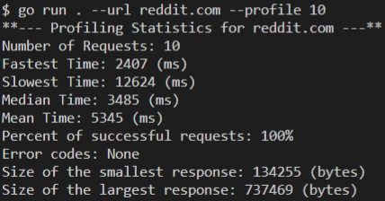

# Systems Assignment (Golang)

## How to build CLI Tool

Change directory to where the root folder is located and run `run go . --help` for avaiable usage

## Findings
* We expect that "Assignment" will have the fastest response time because of Cloudflare's Isolates, Compute per Request, and Distributed Execution.
* Because the workers processes are able to run essentially limitless scripts with almost no individual overhead, any given isolate can start around a hundred times faster than a Node process on a container or virtual machine.
* Upon finishing the assignment, we can indeed confirm that the "Assignment" has the fastest response time. However, for the sake of argument the "Assignment" does have the smallest response size. It would be interesting to see if the "Assignment" was bigger by ~20x (to be similar to a Google response 48k bytes) if it would still have the fastest response time. Upon further exploration, I made my "Assignment" ~50x (125k bytes) than its original size and it ended up having a response time of 343 ms. Although the "Assignment" is now ~3x bigger then the Google response, the response time is still marginally better again confirming that Workers do indeed provide the fastest response time. 
* Also upon finishing the assignment, one can notice that if the profile number is too large the high volume of requests being sent out all at once has a very large range of when the responses come back. A bottle neck occurs so if one is using this a reliability tool, a buffer sleep thread would be need to be implemented to gather more consistent statistics of a website's profile. 

## Assignment Links Response

## Results
Websites Profiled (Assignment, Facebook, Google, Netflix, Reddit, YouTube)

